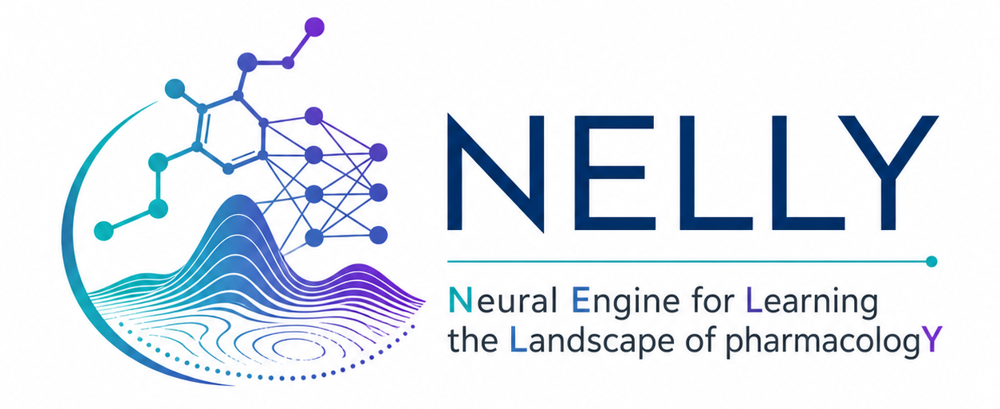

# Welcome to NELLY!

NELLY is a deep learning model integrating transcriptomic and
chemical information to predict drug response and prioritize therapies.
NELLY was designed to address a current limitation of these
approaches: the need to couple accurate prediction with patient-level molecular interpretation.
NELLY uses a drug-conditioned gene-weighting mechanism that modulates transcriptomic features directly for each sample-drug pair. This preserved a direct correspondence between model-derived weights and input genes, enabling patient-level investigation of molecular features associated with predicted drug response. NELLY therefore extends drug response prediction by providing a fine-grained interpretability layer, addressing an important requirement for predictive precision oncology.

To see an overview of this study, have a look at our [poster](poster/ECCB_26.pdf) presented at the 25th European Conference on Computational Biology


# Setup

NELLY was implemented in Pytorch and Lightning with CUDA support. Therefore, the following setup is therefore optimized for systems with and NVIDIA GPU.

NELLY is lightweight and has been tested on GPUs with 8GB of VRAM.
Running NELLY on CPU is also possible, although training will take longer. 

Let's start setting up your local environment:


```python

python3.10 -m venv venv_NELLY

source venv_NELLY/bin/activate

pip install -r python3.10_requirements.txt

```


# Training

You can train NELLY using the following command:

```python

python cli_regressor.py

```


Once you have trained NELLY, you can use it on you data. For an example see:
`DRP_006_PDO_vulnerability_axes.ipynb`


# Reproducibility

## Training data

The drug response data was obtained from the GDSC and the gene expression data was obtained from CellModelPassports. The full data can be downloaded from the following link: https://cellmodelpassports.sanger.ac.uk/downloads.


## Benchmarking models

To benchmark NELLY under comparable and methodologically consistent conditions, we
selected three existing deep learning models for drug response prediction: Paccmann, HiDRA and ScreenDL. These models were chosen because they were developed using GDSC drug response data and share the same core input modalities as NELLY: gene expression and drug chemical information, thereby making them directly comparable. At the same time, they represent distinct state-of-the-art strategies for DRP, including multimodal multi-head attention-based integration, pathway-informed hierarchical attention and deep neural drug-response modeling.

The code to reproduce our analysis can be found in the folder `benchmarking_models/`.
However, one have to first download each model and setup their corresponding environment.
You can find these models in the following repositories:

- Paccmann: https://github.com/PaccMann/paccmann_predictor
- HiDRA: https://github.com/GIST-CSBL/HiDRA
- ScreenDL: https://github.com/csederman/screendl

